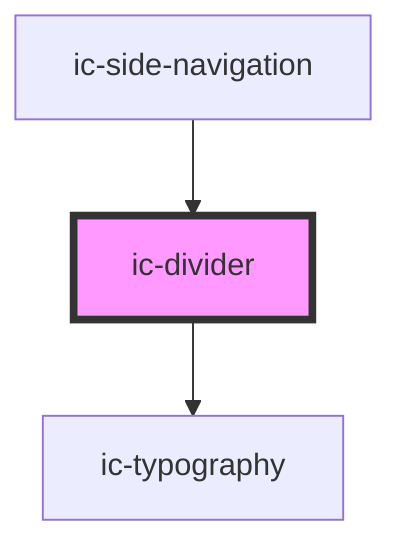

# ic-divider

<!-- Auto Generated Below -->

## Properties

| Property         | Attribute         | Description                                                                                                                                                                                                                                                                              | Type                                                 | Default        |
| ---------------- | ----------------- | ---------------------------------------------------------------------------------------------------------------------------------------------------------------------------------------------------------------------------------------------------------------------------------------- | ---------------------------------------------------- | -------------- |
| `borderStyle`    | `border-style`    | The line style of the divider.                                                                                                                                                                                                                                                           | `"dashed" \| "solid"`                                | `"solid"`      |
| `label`          | `label`           | The label for the divider.                                                                                                                                                                                                                                                               | `string`                                             | `undefined`    |
| `labelPlacement` | `label-placement` | The position the label is placed on the divider. `Left` and `right` placement is only applicable when orientation is set to `horizontal`. `Top` and `bottom` placement is only applicable when orientation is set to `vertical`. `Center` placement is applicable for both orientations. | `"bottom" \| "center" \| "left" \| "right" \| "top"` | `"center"`     |
| `monochrome`     | `monochrome`      | If `true`, the breadcrumb will display as black in the light theme, and white in the dark theme.                                                                                                                                                                                         | `boolean`                                            | `false`        |
| `orientation`    | `orientation`     | The orientation of the divider.                                                                                                                                                                                                                                                          | `"horizontal" \| "vertical"`                         | `"horizontal"` |
| `theme`          | `theme`           | Sets the theme color to the dark or light theme color. "inherit" will set the color based on the system settings or ic-theme component.                                                                                                                                                  | `"dark" \| "default" \| "inherit" \| "light"`        | `"inherit"`    |
| `weight`         | `weight`          | The thickness of the divider.                                                                                                                                                                                                                                                            | `"medium" \| "thick" \| "thin" \| "very-thick"`      | `"thin"`       |

## CSS Custom Properties

| Name                                 | Description                                                         |
| ------------------------------------ | ------------------------------------------------------------------- |
| `--ic-divider-background`            | The color of the divider.                                           |
| `--ic-divider-background-monochrome` | The color of the divider in monochrome mode.                        |
| `--ic-divider-horizontal-width`      | The width of a horizontal divider. The default value is `inherit`.  |
| `--ic-divider-label`                 | The color of the divider label.                                     |
| `--ic-divider-label-monochrome`      | The color of the divider label in monochrome mode.                  |
| `--ic-divider-label-width`           | The width of the divider label. The default value is `max-content`. |
| `--ic-divider-vertical-height`       | The height of a vertical divider. The default value is `inherit`.   |
| `--ic-divider-weight`                | The thickness of the divider.                                       |

## Dependencies

### Used by

 - [ic-side-navigation](../ic-side-navigation)

### Depends on

- [ic-typography](../ic-typography)

### Graph

----------------------------------------------

